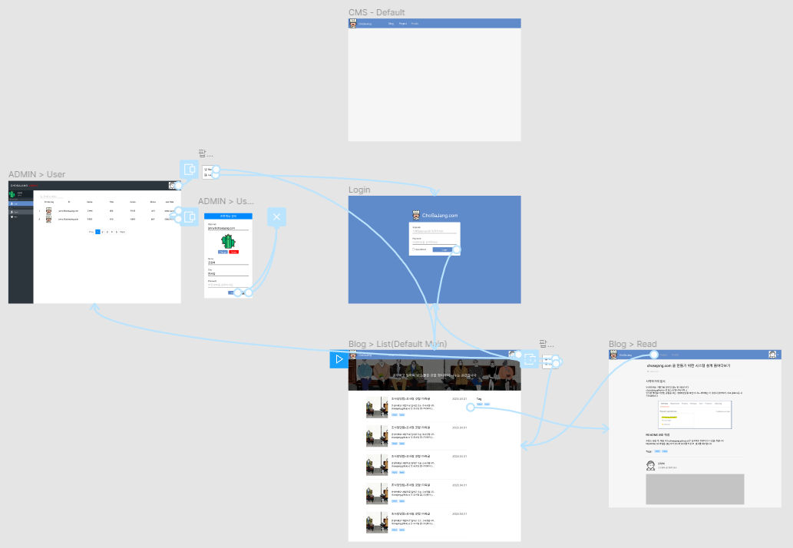

# 조사장닷컴(chosajang.com)

개인 사이트를 직접 기획부터 개발까지 모든 것을 다 해보고 싶어서 시작한 프로젝트입니다.

SPA 개념을 익히기 위해 vue.js로 진행중이며, Bootstrap 및 일부 css를 작업하여 화면을 만들었습니다.

> **Front-end 프로젝트** - Vue.js + jQuery + Bootstrap + Awesome Font

## 기획
기획은 피그마(Figma)라는 프로토타입툴을 사용하여 제작하고 있습니다.
 > [조사장닷컴 기획문서](https://www.figma.com/proto/GihV1M0MoSvTPNtzB2xVxU/%EC%A1%B0%EC%82%AC%EC%9E%A5%EB%8B%B7%EC%BB%B4?node-id=7%3A2&scaling=min-zoom, "figma link")

## 로그인 후 관리자 사용까지

