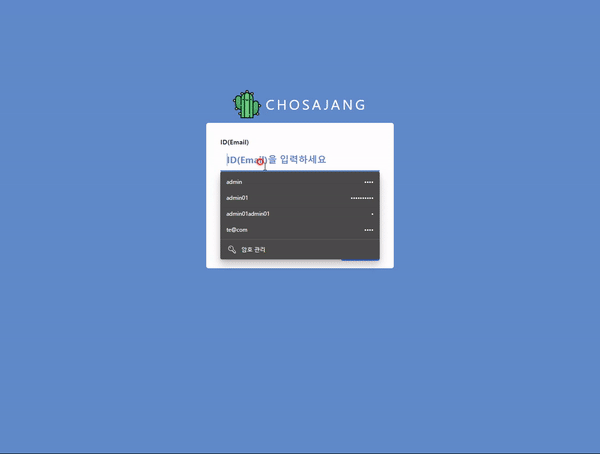

# 조사장닷컴(chosajang.com)
개인 사이트를 직접 기획부터 개발까지 모든 것을 다 해보고 싶어서 시작한 프로젝트입니다.

Front/Back-end 두개의 프로젝트를 진행하고 있으며, github.io 도메인 사용을 위한 웹서비스용 저장소를 포함한 총3개의 저장소를 사용합니다.

> **Front-end 프로젝트** - Vue.js + jQuery + Bootstrap + Awesome Font

## 기획
기획은 피그마(Figma)라는 프로토타입툴을 사용하여 제작하고 있습니다.
 > [조사장닷컴 기획문서](https://www.figma.com/proto/GihV1M0MoSvTPNtzB2xVxU/%EC%A1%B0%EC%82%AC%EC%9E%A5%EB%8B%B7%EC%BB%B4?node-id=39%3A0&scaling=min-zoom, "figma link")

## 로그인

